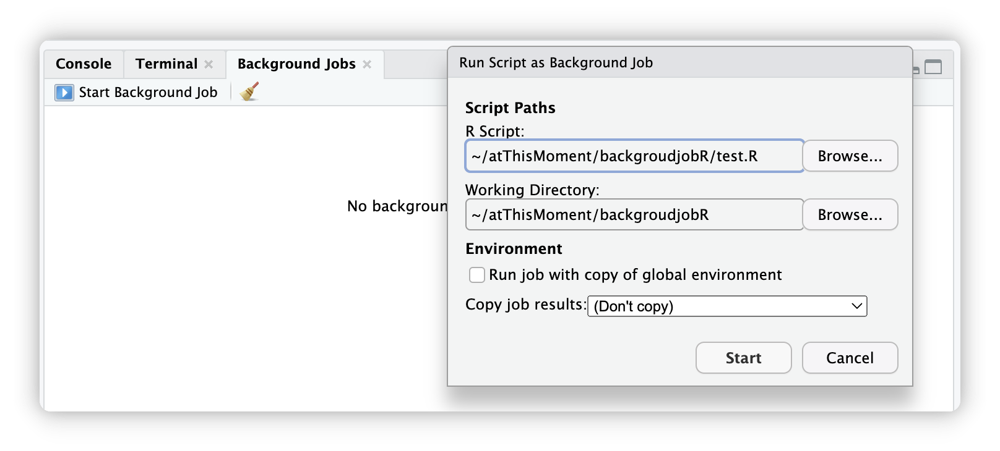

# backgroudjobR

<!-- badges: start -->

[](https://lifecycle.r-lib.org/articles/stages.html#experimental)

<!-- badges: end -->

## Aim

Do you miss RStudio's background jobs feature in terminal, VSCode or in the new developed IDE `Positron`? Though `Positron` have a multiple-console feature, but it is unstable in many cases (See their github issues).



So `backgroudjobR` is developed for solve this problem.

## Overview

`backgroudjobR` is an R package that provides robust and flexible solutions for executing R scripts with comprehensive error handling, logging, and background processing capabilities. Whether you need to run scripts locally, in the background, or on remote servers, this package offers the tools to do so safely and efficiently. This package is powered by the powerful `mirai` package, for providing the background execution and automatic load balancing framework.

### Key Features

-   **🔒 Safe Execution**: Run R scripts in isolated environments with comprehensive error handling
-   **📝 Comprehensive Logging**: Automatic logging of execution progress, errors, and memory usage (Please refer to `package website`'s `Article` -\> `Log Example` for details)
-   **💾 Auto-Recovery**: Automatic environment saving when errors occur for debugging
-   **🚀 Background Processing**: Execute jobs in background using the powerful `mirai` framework
-   **🖥️ Server-Friendly**: Create standalone projects for execution with `screen`, `tmux`, or `nohup`
-   **📊 Memory Monitoring**: Built-in memory usage tracking and limits
-   **⚡ Parallel Execution**: Support for multiple background jobs with automatic load balancing (by `mirai`)

## Installation

You can install the development version of `backgroudjobR` from GitHub:

``` r
# Install from GitHub
if (!require(remotes)) install.packages("remotes")
remotes::install_github("ZhimingYe/backgroudjobR")
```

## Use Cases

### 🔬 Research and Data Analysis

-   Run long-running statistical analyses safely
-   Process large datasets with memory monitoring
-   Execute multiple analysis pipelines in parallel

### 🖥️ Server and HPC Environments

-   Create persistent jobs that survive session disconnections
-   Run analyses on remote servers using `screen`/`tmux`
-   Batch processing with automatic error recovery

### 🐛 Debugging and Development

-   Safe script testing with automatic environment saving
-   Detailed logging for troubleshooting
-   Isolated execution environments

## Getting Help

-   Check function documentation: `?run_local_job`

## Acknowledgments

-   The `mirai` package for providing the background execution framework
